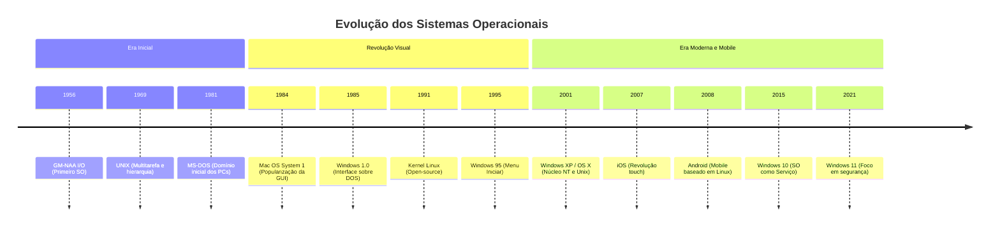

# Aula 01 - Apresentação da Disciplina e Introdução aos Sistemas Operacionais

## 📋 Informações da Disciplina
- **Professor:** Me. Deivison S. Takatu
- **Fórmula de Avaliação:** `(P1 * 0.25) + (P2 * 0.25) + ((PJ + AT) * 0.25)`
  - *P1/P2:* Provas teóricas/práticas.
  - *PJ:* Projeto.
  - *AT:* Atividades.

---

## 1. O que são Sistemas Operacionais (SO)?
O Sistema Operacional é o software fundamental que atua como gerenciador de recursos e máquina estendida.
- **Gerenciador de Recursos (Visão Top-Down):** Controla e aloca processador, memória, dispositivos de Entrada/Saída (E/S) e rede de forma justa e eficiente entre os diversos programas e usuários.
- **Máquina Estendida (Visão Bottom-Up):** Oculta a complexidade do hardware (fios, interrupções, registradores) fornecendo uma interface simples, limpa e padronizada (APIs/System Calls) para os desenvolvedores.
- **Exemplos de Mercado:** Windows, distribuições Linux (Ubuntu, Debian, Fedora), macOS, Android, iOS.

---

## 2. Estrutura Interna e Componentes
A arquitetura de um SO define como seus componentes interagem. As abordagens mais comuns são:
- **Monolítica:** Todo o SO (gerenciamento de memória, arquivos, escalonamento) roda em um único grande bloco no espaço de kernel. (Ex: Linux, MS-DOS).
- **Microkernel / Modular:** Apenas as funções mais vitais rodam no kernel. O restante (como sistema de arquivos) roda no espaço do usuário como serviços, aumentando a segurança e facilitando a manutenção.

### O Kernel (Núcleo)
É o coração do sistema, carregado na memória RAM durante o boot. Ele possui controle absoluto e incondicional sobre o sistema de hardware.

### Modos de Operação (Dual-Mode) e Proteção
A CPU possui um bit de modo no hardware que garante a segurança do sistema:
- **Modo Usuário (User Mode - Bit 1):** Aplicações comuns rodam aqui. O acesso à memória e às instruções do processador é restrito.
- **Modo Kernel (Supervisor/Privileged Mode - Bit 0):** Acesso total ao hardware e à memória.
- **System Calls (Chamadas de Sistema):** É a "ponte". Quando um programa no Modo Usuário precisa de um recurso de hardware (como ler um arquivo ou imprimir algo), ele faz uma *System Call*, que gera uma interrupção por software (trap) mudando a CPU para o Modo Kernel temporariamente.

---

## 3. Gerenciamento de Processos e Escalonamento
Um processo é um programa em execução (incluindo seu contador de programa, registradores e variáveis).

### Estados de um Processo
1. **Novo:** Sendo criado.
2. **Pronto:** Aguardando ser atribuído ao processador.
3. **Executando:** Instruções estão sendo processadas.
4. **Bloqueado (Espera):** Aguardando um evento (como entrada de teclado ou leitura de disco).
5. **Finalizado:** Terminou a execução.

### Escalonamento da CPU
O SO precisa decidir qual processo na fila de "Prontos" vai usar a CPU através do **Context Switch (Troca de Contexto)**.
- **FIFO (First-In, First-Out):** O primeiro a chegar é o primeiro a ser atendido. Simples, mas pode causar o "efeito comboio" se um processo longo chegar primeiro.
- **Round Robin (Chaveamento Circular):** Cada processo recebe uma "fatia de tempo" (*quantum*). Se não terminar, volta pro fim da fila. Excelente para sistemas interativos.
- **Por Prioridade:** Processos críticos ganham a CPU primeiro. (Pode gerar *Starvation* se processos de baixa prioridade nunca forem atendidos).

---

## 4. Gerenciamento de Memória
A memória precisa ser alocada eficientemente para que múltiplos processos coexistam sem interferir uns nos outros.

- **Memória Real (Principal / RAM):** O SO rastreia quais partes da memória estão em uso e quais estão livres, além de gerenciar a MMU (Memory Management Unit) no hardware.
- **Memória Virtual (Paginação e Segmentação):**
  - Permite que o sistema execute programas maiores que a RAM física disponível.
  - O SO divide a memória lógica em blocos de mesmo tamanho chamados **Páginas**, e a RAM física em **Quadros (Frames)**.
  - O que não cabe na RAM é temporariamente movido para o disco rígido (Swap).
  - Garante isolamento: um processo não consegue acessar a página de memória de outro.

---

## 5. Dispositivos de E/S e Sistemas de Arquivos
- **Entrada e Saída (E/S):** O SO usa *Device Drivers* para traduzir comandos genéricos do sistema operacional em instruções elétricas específicas para cada placa ou periférico.
- **Sistema de Arquivos:** Abstrai os blocos físicos do disco rígido/SSD em um formato lógico de "Pastas e Arquivos". Controla permissões, integridade e armazenamento.
  - *Exemplos:* NTFS (Windows), ext4 (Linux), APFS (macOS).

---

## 📌 Tarefas da Atividade 01
- [x] Criar repositório no GitHub.
- [x] Criar arquivo Markdown (`.md`) com o resumo completo da Aula 01.
- [ ] Desenvolver colaborativamente no Miro uma linha do tempo (mapa mental) com os anos de lançamento e evolução histórica dos sistemas operacionais.
- [ ] Transformar o conteúdo estruturado do Miro em `.md` (Markdown) e registrar o commit no repositório.

## 📌 Atividade 01
# ⏳ Linha do Tempo: Evolução dos Sistemas Operacionais

---

## 📊 Visualização Dinâmica:

_Esta linha do tempo detalha os principais marcos na história dos Sistemas Operacionais, desde os primeiros sistemas de processamento em lotes até a consolidação dos ecossistemas móveis e modernos._

---

# 🚀 A Jornada dos Sistemas Operacionais: Do Zero à Inteligência Artificial

A evolução dos Sistemas Operacionais (SO) reflete a própria história da computação. O que antes exigia esforço físico para conectar cabos, hoje ocorre de forma invisível em nossos bolsos e na nuvem. Abaixo, o resumo das **6 grandes gerações**[cite: 2].

---

## ⚙️ 1ª Geração (1945 – 1955): A Era Mecânica e das Válvulas
Nesta época, **não existiam Sistemas Operacionais**[cite: 2]. O hardware era colossal, caro e frágil.

*   **🛠️ Hardware:** Válvulas a vácuo, relés eletromagnéticos e painéis de fiação[cite: 2].
*   **👨‍💻 Como funcionava:** A programação era feita fisicamente (conectando e desconectando cabos) ou usando código de máquina absoluto. Uma mesma equipe construía, programava e operava o computador[cite: 2].
*   **🌟 Marcos:** ENIAC, Colossus e a posterior adoção dos **cartões perfurados** no início dos anos 1950[cite: 2].

---

## 💾 2ª Geração (1955 – 1965): Transistores e o Processamento em Lote
O computador fica um pouco menor e mais confiável, e surge a necessidade de otimizar o tempo de uso das caras CPUs.

*   **🛠️ Hardware:** Transistores, fitas magnéticas e memórias de núcleo magnético[cite: 2].
*   **📦 Sistemas em Lote (Batch):** Para não perder tempo, os trabalhos (*jobs*) eram agrupados em fitas magnéticas por um computador menor e processados de uma só vez pelo mainframe[cite: 2].
*   **🧑‍🔧 Divisão de Tarefas:** Surge a figura do operador de máquina, separada da do programador[cite: 2].
*   **🌟 Marcos:** Sistemas primitivos como **FMS** e **IBSYS**, além de linguagens como FORTRAN[cite: 2].

---

## 🖥️ 3ª Geração (1965 – 1980): Circuitos Integrados e Multiprogramação
A era de ouro dos mainframes e o nascimento dos conceitos modernos de computação.

*   **🛠️ Hardware:** Circuitos Integrados (CIs) e discos rígidos primitivos[cite: 2].
*   **🔄 Multiprogramação & Timesharing:** O SO agora dividia a memória para manter vários programas rodando simultaneamente (Multiprogramação) e permitia que múltiplos usuários usassem a máquina ao mesmo tempo via terminais (*Timesharing*)[cite: 2].
*   **🌟 Marcos:** 
    * O icônico **OS/360** da IBM[cite: 2].
    * **MULTICS**: Pioneiro em abstração de arquivos e segurança[cite: 2].
    * O nascimento do poderoso **UNIX** (1969), escrito em linguagem C[cite: 2].

---

## 🖱️ 4ª Geração (1980 – 2000): O Computador Pessoal e as Interfaces Gráficas
A computação sai dos grandes laboratórios e invade as casas e os escritórios.

*   **🛠️ Hardware:** Microprocessadores (LSI/VLSI), PCs de mesa[cite: 2].
*   **🎨 Interfaces Gráficas (GUI):** Saímos da tela preta com texto para o mundo do mouse, janelas e ícones (WIMP)[cite: 2].
*   **🌟 Marcos:**
    * **Mercado Comercial:** **MS-DOS**, Apple Macintosh (1984) e a evolução do **Microsoft Windows** (do 1.0 ao XP)[cite: 2].
    * **Revolução Open Source:** Andrew Tanenbaum cria o **MINIX**, que inspira Linus Torvalds a lançar o **Linux** em 1991[cite: 2].

---

## 📱 5ª Geração (2000 – 2015): Mobilidade, Nuvem e Virtualização
A internet se torna onipresente. O computador deixa de ser apenas a máquina na mesa e passa a ser o celular no bolso e o servidor remoto.

*   **🛠️ Hardware:** Processadores Multi-core, Smartphones e Datacenters gigantescos[cite: 2].
*   **☁️ Computação em Nuvem e VMs:** Consolidação dos Hipervisores (como VMware e Hyper-V). Em vez de rodar um SO direto na máquina física, roda-se dezenas de Máquinas Virtuais no mesmo hardware[cite: 2].
*   **🌟 Marcos:** A guerra dos SOs móveis vencida pelo **Android** (Google, 2008) e **iOS** (Apple, 2007)[cite: 2].

---

## 🤖 6ª Geração (2015 – Presente): IA, Contêineres e Segurança
O limite entre hardware, nuvem e inteligência artificial desaparece. A performance extrema e a segurança viram as maiores prioridades.

*   **🛠️ Hardware:** Chips Heterogêneos (SoC, ARM), NPUs (Unidades de Processamento Neural) e Edge Computing[cite: 2].
*   **🐋 Revolução dos Contêineres:** **Docker** e **Kubernetes** substituem as VMs pesadas por contêineres leves, mudando o gerenciamento de recursos[cite: 2].
*   **🛡️ Segurança e Observabilidade:** 
    * Uso da linguagem **Rust** no kernel (Linux e Windows) para evitar falhas de memória[cite: 2].
    * **eBPF** permitindo rodar códigos de segurança e monitoramento diretamente no núcleo do sistema[cite: 2].
*   **🌟 Marcos:** A IA passa a ser integrada **nativamente** no SO, orquestrando recursos, privacidade e tarefas locais (Copilot+ PCs, Apple Intelligence)[cite: 2].

> 💡 *A grande lição da evolução dos Sistemas Operacionais é a busca constante por **abstração**: esconder a complexidade brutal do hardware para entregar interfaces simples, seguras e cada vez mais inteligentes aos usuários.*

---

## 📚 Referências Bibliográficas e Web:
* **TANENBAUM, Andrew S.; BOS, Herbert.** *Sistemas Operacionais Modernos*. 4. ed. São Paulo: Pearson, 2016.
* **SILBERSCHATZ, Abraham; GALVIN, Peter B.; GAGNE, Greg.** *Fundamentos de Sistemas Operacionais*. 9. ed. Rio de Janeiro: LTC, 2015.
* **STALLINGS, William.** *Sistemas Operacionais: Conceitos e Projetos*. 8. ed. São Paulo: Pearson, 2015.
* **IBM.** *O que é um Sistema Operacional?* IBM Think Topics. Disponível em: https://www.ibm.com/br-pt/think/topics/operating-systems
* **WIKIPEDIA.** *History of operating systems*. Disponível em: https://en.wikipedia.org/wiki/History_of_operating_systems

